# 社会计算第二次实验报告
- 胡煜霄 SA20011027 
- 黄奕桐 SA20011029 
- 马煜昕 SA20011048 
- 华力 SL20215006 
- 尚飞 SA20011054 
- 王雪红 SA20229066 
## 简介
本实验使用了来自Meetup的数据集进行社交分析，实验要求我们在两种情况下对用户面对活动邀请的回应进行预测
- 不考虑社交因素的预测(基本推荐)
- 考虑社交约束的预测(社交推荐)
考虑到我们对于数据集的特征不太了解，因此我们还采用了神经网络的方式来尝试提取一些特征，因此我们共进行了如下三部分实验：
- 基本推荐
- 社交推荐(社交约束， 社交级联)
- 社交推荐(神经网络)
## 第一部分

### 协同过滤算法简介
&emsp;&emsp;推荐算法的本质是矩阵补全，相应的，协同过滤的思想是基于矩阵的其他行，协助补全本行的空缺。本实验以事件作为基本单位进行划分，如果成员A去参加则记为1，不去则记为-1，maybe记为0。
&emsp;&emsp;常用的协同过滤算法分为两种：基于用户的协同过滤算法和基于物品的协同过滤算法。本实验采用基于活动的协同过滤算法。计算不同活动之间的相似性，找出与活动相似的前K个活动。基于活动的特征(所属社团和活动组织者)计算活动之间的相似性，计算公式为: $$sim(a,b)=|N(a)\cap N(b)|$$ $N(a)$表示活动的特征，即活动的相似性为两个活动共同的特征数量。预测时针对活动的特征计算相应用户参与该活动的前K个相似活动的数量作为预测的依据。
### 五折五次交叉验证
&emsp;&emsp;通常一次实验的结论并不能很有力的证明，因为数据本身可能存在偶然性。交叉验证的思想就是将数据集先分成K份，然后将其中K-1份数据作为训练集，剩下的一份作为测试集，来对算法模型进行评估。如此循环，直至每份数据集都被当作一次测试集以后，最后对每次试验的结果求平均作为最终的检验结果。

### 社团在个人决策中的作用

&emsp;&emsp;在考虑衡量事件相似性时，我们分别以只考虑组织者因素、只考虑社团因素、同时考虑两者等三种情况来预测受邀成员的行为，通过预测结果的准确率来分析社团在个人决策种的作用。其中组织者因素的具体做法是将同一事件种每个组织者的标签取并集来作为该事件的特征，用两个事件特征交集的元素个数作为两个事件的相似度，然后用协同过滤的方法来预测受邀成员的行为。其他两种情况做类似处理。结果如下图所示。

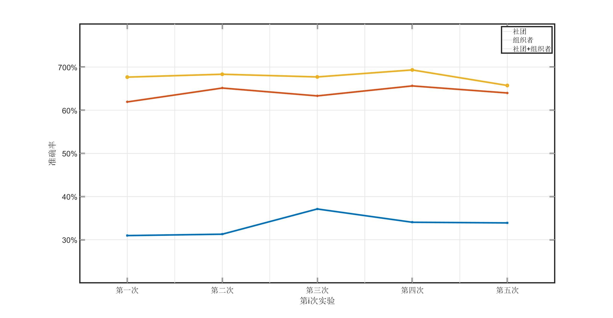

&emsp;&emsp;进行五次实验，只考虑组织者因素时，准确率的均值为 $33.46\%$；只考虑社团因素时，准确率的均值为 $64.00\%$；综合两者进行考虑时，准确率的均值为 $67.75\%$。分析发现，成员在决定自己自己是否参加活动时，社团产生的影响远大于活动组织者。如果一个成员经常参加某一社团的活动，那在该社团举办一个新的活动时，该成员会倾向于参加，而即使某一成员在过去经常参加某一组织者组织的活动时，当该组织者举行新的活动时，成员也不一定会参加。

### 成员标签对决策的影响

&emsp;&emsp;我们定义成员$m$ 与事件 $e$ 的标签重合度为：
$$
R_{m,e} = \frac{|T_m \cap T_E|}{|T_m|}
$$
其中$T_m$ 表示成员$m$ 的标签集合，$T_e$ 表示事件 $e$ 的标签集合，$|T|$ 表示集合$T$ 种元素的个数。

首先分析在一个事件参与的成员中中，成员标签与事件标签的平均重合度的分布情况。我们将平均重合度分成5个区间，$[0,20\%), [20\%,40\%), [40\%,60\%), [60\%,80\%), [80\%,100\%)]$。对于区间$i$，计算属于该区间的成员人数占比：
$$
rate_i = \frac{\sum_{m}N_m^i}{\sum_{m}\sum_i N_m^i}
$$
其中$N_m^i$表示在参与事件$m$ 的成员中，与$m$的标签重合度属于区间$i$的人数。

可以发现来参加活动的成员中大部分的标签重合度在$[0,20\%)$，其次是超过$80\%$ 的。发现大部分参与活动的成员与活动的主题并不非常契合。

用类似的方法计算一个事件拒绝参与的成员中中，成员标签与事件标签的平均重合度的分布情况。

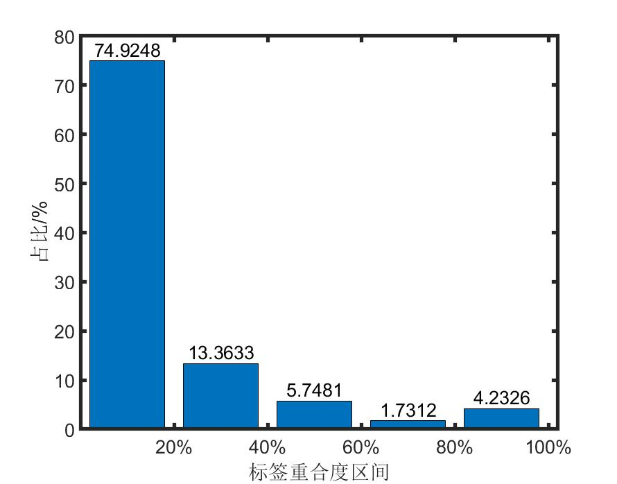

可以发现来拒绝参加活动的成员中大部分的标签重合度在$[0,20\%)$，当标签的重合度超过$40\%$时，占比就比较少。

然后我们来分析如果一个成员与一个事件的标签重合度在区间$i$ 中，他参与该事件的概率。概率定义为：
$$
p_i = \frac{\sum_eY_e^i}{\sum_eM_e^i}
$$
其中$Y_e^i$表示参与事件$e$的成员中与该事件标签重合度在区间$i$的中人数，$M_e^i$表示所有与事件$e$标签重合度在区间$i$中的成员人数。结果如下图所示：

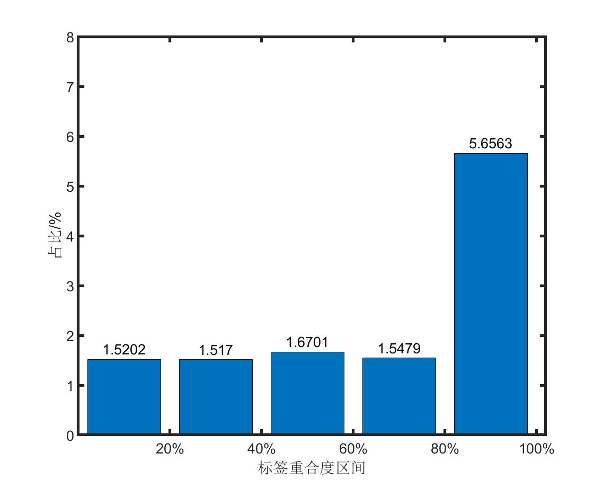

可以发现，标签的重合度并不对一个成员是否参加活动起决定性作用，但是如果标签重合度超过了$80\%$ ，那它对成员决策的影响将显著提高。

### 个人偏好随时间
&emsp;&emsp;设成员$m$在$t$时刻参加对事件$e$的回应为yes，则将事件$e$对应的标签看作该成员在$t$时刻的兴趣。首先，我们将各个成员参加的事件按时间排序，获取对应时刻成员的兴趣标签。如果一个成员只参加了一次活动或从未参加活动，那么无法观察他的兴趣变化。因此我们选出那些参加了两次及以上活动的成员，然后我们计算每一成员最终兴趣与最初兴趣的重合程度。得到的结果如下图所示：

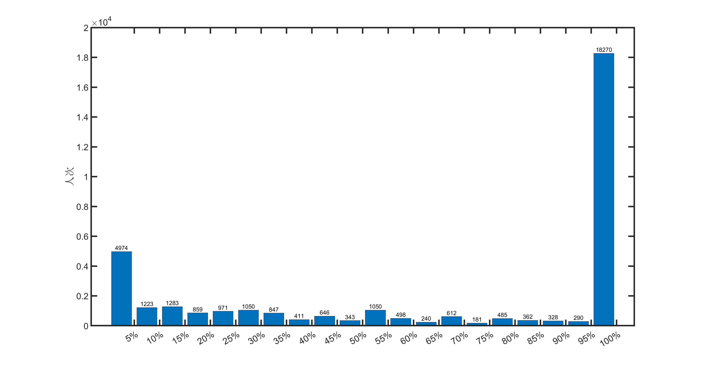

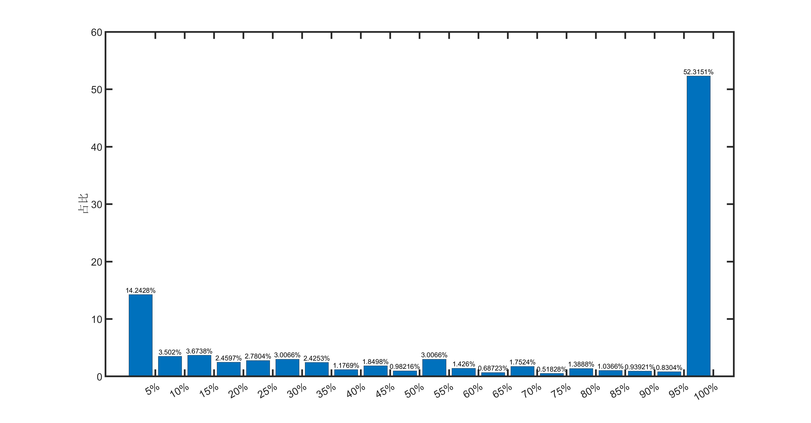

可以发现有18270人最终兴趣与最初兴趣的重合程度超过$95\%$，占所有参加两次及以上活动成员总数的$53.3151\%$；其次是前后兴趣重合程度低于$5\%$的，有4974人次，占所有参加两次及以上活动成员总数的$14.2428\%$。其他区间中人数分布较为平均，可以发现大多数成员的兴趣不太会随时间变化，但有部分成员爱好广泛，在这两个极端之间人群比较小众。

但是由于只用第一次与最后一次活动的标签重合程度无法反映成员的兴趣随时间变化的速度，而且可能具有偶然性。比如某一成员前几次都参加相似的活动只有最后一次尝试了一个新领域的活动，在这种情况下他兴趣的变化速度可能不是很快，但会被以上算法分到了小于$5\%$的区间。为了避免这一点，我们定义了成员$m$兴趣的平均变化速率：
$$
v_m = \frac{\sum_e \frac{\Delta e_{Topic}}{\Delta e_{Time}}}{N_e^i}
$$
其中$\Delta e_{Topic}$和$\Delta e_{Time}$ 分别表示事件$e$与成员$i$最初参加的事件之间标签的不同程度和时间的差别，$\Delta e_{Topic}$越大、$\Delta e_{Time}$越小则二者的比值越大，该成员的兴趣变化速率越快。 $N_e^i$代表该成员参与的时间总数。我们对$\Delta e_{Time}$做了归一化处理，即用实际的时间差除以所有事件中最大的时间差作为这里的$\Delta e_{Time}$。将所得的变化速率按50一个区间做出柱状图，如下图所示：

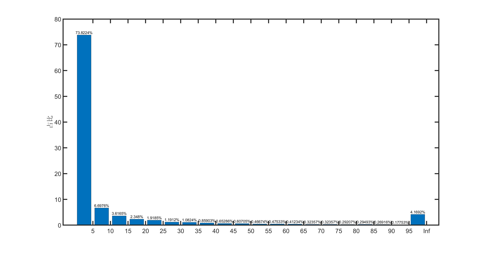

可以看出绝大多数成员的兴趣变化速率都不快，少部分成员兴趣变化很快，介于两者之间的则属于小众群体。

### 冷启动的有效处理

&emsp;&emsp;对于在训练数据中未出现的用户，我们计算该用户与该事件的标签重合。然后在训练集中找到该事件的相似事件，计算参与相似事件成员的标签重合度的分布，依据这个概率来判断在训练集中的用户是否参加活动。即如果某一用户的事件的标签重合度在区间$i$中，则他参与该事件的概率为：
$$
P_i = \frac{\sum_{m}N_m^i}{\sum_{m}\sum_i N_m^i}
$$
其中$N_m^i$表示在参与事件$m$ 的成员中，与$m$的标签重合度属于区间$i$的人数。

加入冷启动之后，五次实验的准确率为：

|        | 第一次 | 第二次 | 第三次 | 第四次 | 第五次 |
| ------ | ------ | ------ | ------ | ------ | ------ |
| 准确率 | 74.16% | 74.27% | 75.05% | 75.77% | 75.11% |

均值为$74.87\%$，方差为$3.5483*10^5$

### 不同验证指标的相互比较
&emsp;&emsp;该问题属于分类问题，评价指标可以用Precision、Recall、Accuracy等。其中$$Accuracy={TP+TN\over TP+FP+FN+TN}$$表示准确率，即正确预测样本的比例。$$Precision={TP\over TP+FP}$$表示精确率，即预测为正类的样本中真正例的比例。这里指成员被预测为“yes”中的人真正参加的人的比例。$$Recall={TP\over TP+FN}$$表示召回率，即预测为正例的样本占所有正例样本的比例。这里表示真正去参加的人中被预测为“yes”的比例。

|          | 第一次 | 第二次 | 第三次 | 第四次 | 第五次 |
| -------- | ------ | ------ | ------ | ------ | ------ |
| Accuracy | 0.6767 | 0.6833 | 0.6771 | 0.6933 | 0.6573 |
均值为0.6775，方差为$1.38*10^{-4}$      
|           | 第一次 | 第二次 | 第三次 | 第四次 | 第五次 |
| --------- | ------ | ------ | ------ | ------ | ------ |
| Precision | 0.7586 | 0.7366 | 0.7428 | 0.7460 | 0.7421 |
均值为0.7408，方差为$7.34*10^{-5}$。
|        | 第一次 | 第二次 | 第三次 | 第四次 | 第五次 |
| ------ | ------ | ------ | ------ | ------ | ------ |
| Recall | 0.8419 | 0.8143 | 0.8134 | 0.8424 | 0.8282 |
均值为0.8280，方差为$2.05*10^{-4}$。
可以看出预测的准确率虽然不是特别高，但是召回率还是比较OK的。

## 第二部分(社交约束、级联)

### 实验内容
本部分实验为实现社交约束下的预测，使用不同的方式构造社会网络，使用网络对成员面对一个活动的邀请时的决定进行预测。
该部分要求对以下内容进行分析：
- 不同网络构造方式对结果的影响
- 网络结构演化对结果的影响
- 网络是否加权对结果的影响
- 社交约束与社交级联设计下的效果对比

可选内容：
- 不同社交约束设计方式对效果的影响
- 网络稀疏性问题的有效处理
- 参数敏感性讨论

### 实验分工
本部分需要对社交约束进行分析，因此本部分的实验分为两部分：
1. 使用社交约束和社交级联进行预测
2. 使用神经网络进行预测

### 实验过程

#### 构造网络
我们首先尝试了直接建立完整的用户相关矩阵，但是数据集中用户有7万多，完整的矩阵需要占用的内存难以用PC机进行运行测试。
随后我们观察了数据集的特征，发现实际上每个事件中做出回应的人的数量很少，因此我们决定在对某件事件进行预测时将此事件做出回应的用户作为已知，仅对这些用户构建网络，以此来控制关系矩阵的稀疏性。
在实验的过程中，我们分别使用用户的Topic相似度，参加的Event相似度，以及对不同事件做出的选择进行了网络的构建。

#### 数据划分
实验要求中要求我们对数据进行五折划分，但是考虑到还需要计算网络结构演变造成的影响，我们采用两种划分方式：
##### 五折划分
将事件列表打乱，随机五等分，然后分别将每份数据作为测试集，剩余数据作为训练集，进行五轮训练和预测。
##### 网络结构演变
将事件按照事件发生的时间进行排序，每100个事件一批，顺序对每一批事件进行预测，并在预测完之后将预测过的事件的真实情况作为已知的训练集作用于网络结构。
#### 进行实验和算法描述
##### 社交约束
我们首先使用用户的Topic相似度进行网络的构建，并进行五折实验。网络构建以及预测的算法如下:
1. 将训练集中的Event信息加入相关Member数据中
2. 找出与要预测的用户相关性最强(共同Topic最多)的10个邻居
3. 找出这些邻居相关的事件集
4. 有关事件与要预测的事件计算相似度
    4.1. 事件之间的相似度用共同topic数表示：(共有Topic数量 ** 2 / 两者各自的topic数量和) 。这里的共同topic数有两种选择，第一种是根据组织者的topic，第二种是根据邀请人员的所有topic。
5. 事件相似度 * 成员相似度，即为这个事件对某个决定(yes, no, maybe)可能性的权重加成
6. 找出可能性权重最大的一个决定即为预测值

之后我们修改了用户之间的相似度的计算方式，使用用户共同参与的事件计算相似度，进行这个操作时我们构建了完整的用户-事件，使用余弦相似度计算用户之间的相似度，并在服务器上运行，用户与某个事件的相关性或者说评分根据其做出的响应来决定：

| yes  | no   | maybe | organizer | 没评分 |
| ---- | ---- | ----- | --------- | ------ |
| 2    | -1   | 1     | 3         | 0      |

上述为普通的推荐过程，为了引入社交关系进行社交约束。我们采用了两种方法进行约束，第一种是使用训练集里面用户参与的每个事件作为组员，第二种是使用待预测事件邀请的人员作为组员。然后在上面第3点处过滤掉不是组员的邻居进行后续预测。

##### 社交级联

我们首先对社交级联的过程进行分析，由于整个网络过于庞大，因此我们挑选了某个较小的组，仅考虑用户对事件回应yes和no两种情况，在其上构建一个小型的网络来观察社交级联在数据集上的行为：

如果人们倾向于选择yes，则网络的迭代过程如下图所示：

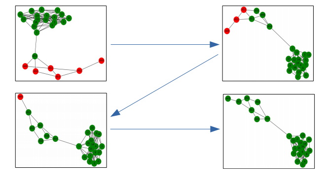

当用户对yes 和 no 的选择相似，则网络在迭代后会呈现如下状态：

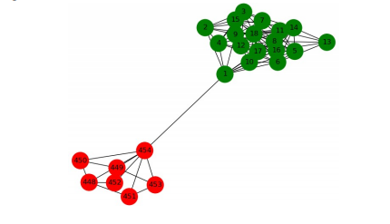

可以看出社交级联可以反映邻居对用户选择产生的影响

随后我们引入社交级联的内容进行分析，算法如下：

1. 首先仍旧是对回应的用户进行网络构建

2. 计算每个用户之间的相似性
    2.1.  一种方式是对用户做出的选择不同分别构建三个矩阵，表示用户对此事件做出各个选择的影响的强度。 此种方式下构建的图是有向的：(member1, member2)的边权为 (member1和member2都作出这种选择的事件数 / member2做出这种选择且member1做出回应的事件数) 这条边的权值即为member2做出一种决定时member1做出相同决定的概率
    2.2. 另一种方式是对用户参与的事件构建用户-事件关系矩阵，依据做出的回应来决定此事件的得分。用户之间的事件相似度用余弦相似度表示，计算方法和社交约束的用户相似度计算方法类似。
3. 初始化网络，使每个成员做出一个初始的决定，这个决定为此成员对这个组中的事件的回应最多次数的决定。
4. 每个成员接受其他成员的影响，并依据不同选择进行加权，将此成员的选择更改为得分最高的选择。并进行10次迭代
5. 最后每个成员的选择即为预测值
##### 网络结构演变
随后我们对网络的演变进行分析，不再使用五折检测，而是使用第二种划分方式，同时对每个事件的预测均使用级联的方式。
首先我们不对事件随时间变化的权重做任何处理，只是训练数据集随时间的变化增加。
然后我们依据时间对事件加上权重，即越久远的事件的权重越轻。这个权重将被用于计算用户间的相似性。

#### 实验结果及分析
##### 社交约束

<table width="485">
<tbody>
<tr>
<td width="112">用户相似度计算</td>
<td width="166">事件相似度计算</td>
<td width="102">社交约束</td>
<td width="105">5折平均准确度</td>
</tr>
<tr>
<td rowspan="6">用户共同topic</td>
<td rowspan="3">组织者共同topic</td>
<td>同Group用户</td>
<td>62.48%</td>
</tr>
<tr>
<td>Event邀请用户</td>
<td>62.81%</td>
</tr>
<tr>
<td>无</td>
<td>62.35%</td>
</tr>
<tr>
<td rowspan="3">Event邀请用户共同topic</td>
<td>同Group用户</td>
<td>66.05%</td>
</tr>
<tr>
<td>Event邀请用户</td>
<td>66.64%</td>
</tr>
<tr>
<td>无</td>
<td>64.94%</td>
</tr>
<tr>
<td rowspan="6">用户共同event</td>
<td rowspan="3">组织者共同topic</td>
<td>同Group用户</td>
<td>66.07%</td>
</tr>
<tr>
<td>Event邀请用户</td>
<td>66.35%</td>
</tr>
<tr>
<td>无</td>
<td>66.21%</td>
</tr>
<tr>
<td rowspan="3">Event邀请用户共同topic</td>
<td>同Group用户</td>
<td>71.65%</td>
</tr>
<tr>
<td>Event邀请用户</td>
<td>72.65%</td>
</tr>
<tr>
<td>无</td>
<td>71.21%</td>
</tr>
</tbody>
</table>

##### 社交级联
| 用户相似度计算 | 5折平均准确度 |
| ---------------------  | --------------------- |
| 用户参与事件的评分矩阵(余弦相似度) | 67.79% |
| 用户对不同事件做出的选择 | 69.60% |
得到了和社交约束差不多的效果。其中使用用户对不同事件做出的选择作为用户相似度计算标准时得到了稍高的准确率，这可能是事件得分规则有些简单，如果能够获得数据集更多的数据，应该能期待更好的结果。
##### 网络结构演变
不对事件进行权重处理时得到结果如下：
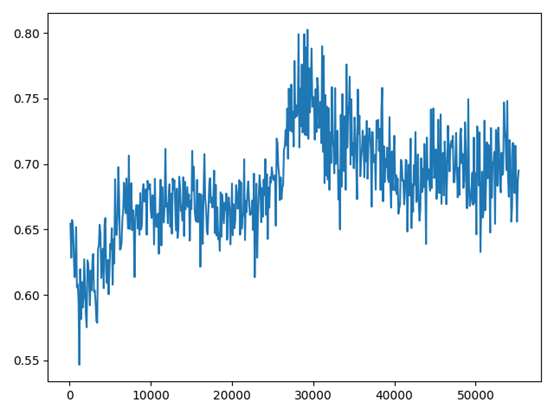
可以见到，随着时间的演变，一开始准确度整体呈上升趋势，但是到接近第30000个事件后，准确度开始有所下降，推测这可能是由于时间长了之后用户的兴趣和决策可能会产生转变，因此最近的事件应对用户决策有较强的影响，比较久远的事件产生的影响更小一点。
因此我们对事件的权重随时间进行调整，但是效果并不理想
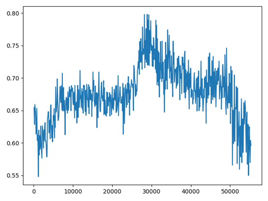
随后我们又依据时间戳的值进行不同的函数运算得到事件的权值，如softmax，线性，开根号等，只有开根号能够达到与不加权重差不多的效果，从第50000个事件开始算，考察其在这个时间点的表现
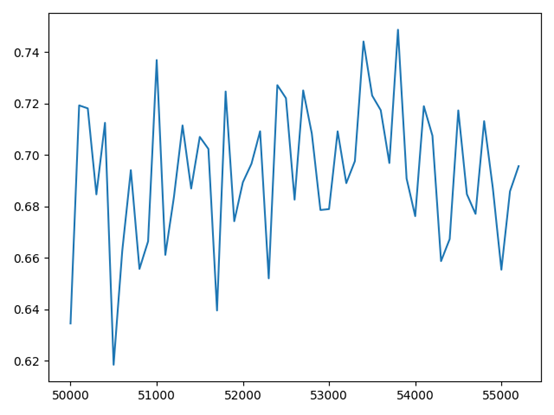
一定程度上遏制了其准确率的显著下降，但是依旧打不到在30000左右的最高准确率表现。推测可能有其他因素产生用户兴趣转移的现象。

## 第二部分（基于神经网络实现的尝试）

### 构造图

首先需要构造一个图，根据参加情况构造一个二分图，节点为event和member，边为member对event的参与情况，event的feature为所在group的topic，member的feature为其本身的topic。

### 预测

通过链接预测的方式预测member对event的反应。

对所要预测的member、event对，基于多层GNN计算它们之间存在链接可能性的得分，到比其与任意一对节点之间的得分的差异，若其得分高于任意的其他点对，则可以认为其之间具有边。

对于member的每一个选项（yes/no/maybe)，将其他选项作为负样本进行分别训练，进行预测时选择置信度最高的一个选项。

### 实验结果

使用四层的GraphSAGE模型，隐层宽度128，loss函数为BCELoss, Adam优化器，初始lr0.02，每800个epoch减半，训练5000个epoch之后，loss降低到0.588， 预测精度为69.1%

### 可改进之处

训练结束时loss仍在缓慢下降，限于时间原因没有进一步进行调参，如果继续调参预计能有小幅提升

对于feature，使用了较为简单的处理，可以考虑采用一些较为复杂的embedding方法，可能有较高提升。

## 总结
我们一共进行了三个部分的实验，预测的准确率均在70%上下。
实验的过程中，我们对数据进行提取和分析，使用分别构建网络的方式避免产生过大的网络以至于内存无法负担。在训练分析时我们尝试利用不同的数据计算用户与事件之间的相似度，并得到了不同的预测准确率。得到结果后我们还使用了不同的指标对其进行分析。
在这个过程中我们将任务分配以并行的进行各个实验，学习了如何利用不同特征表示社交网络中人员之间的联系。
## 分工
- 第一部分：王雪红、尚飞
- 第二部分：
	- 华力：尝试社交级联以及提取小型网络进行可视化
	- 黄奕桐：社交约束分析，将不同特征应用于不同模型
	- 胡煜霄：原始数据提取，社交级联分析，网络的时间演变
- 第三部分：
	- 马煜昕一人负责